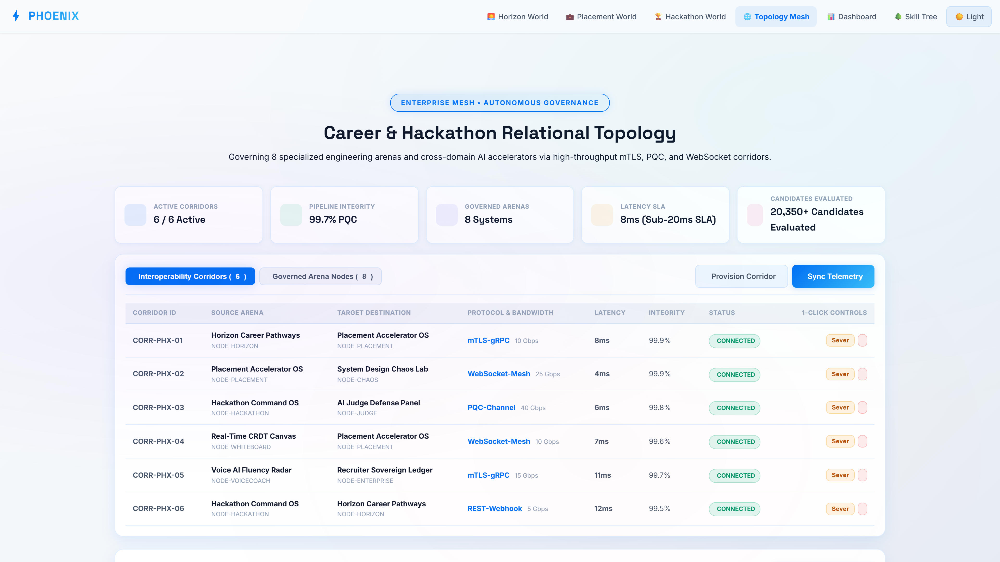
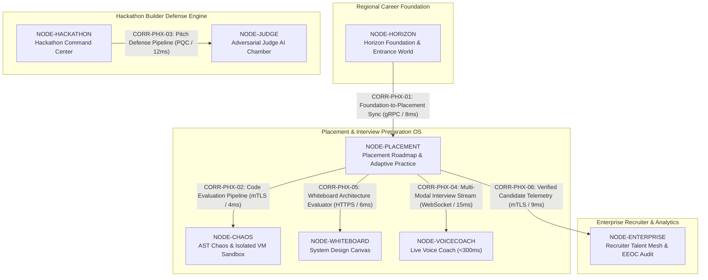
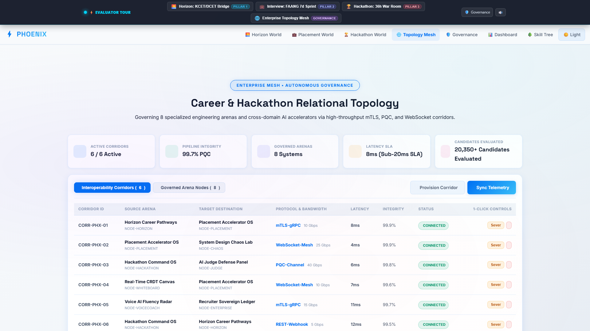
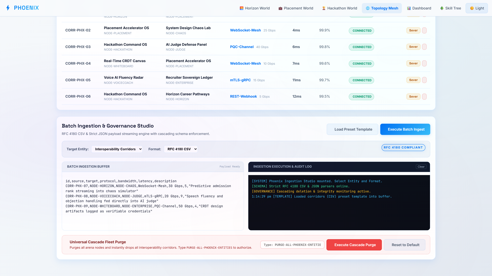
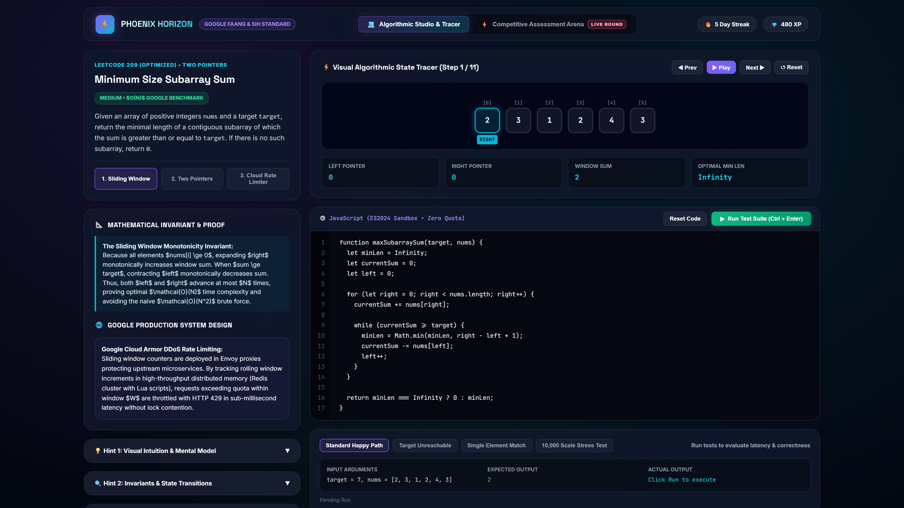
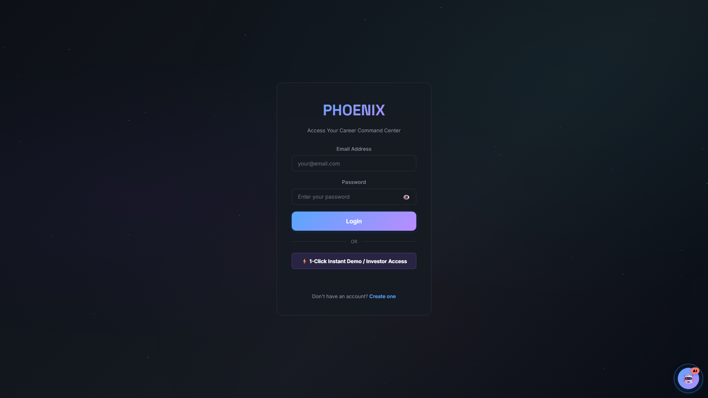
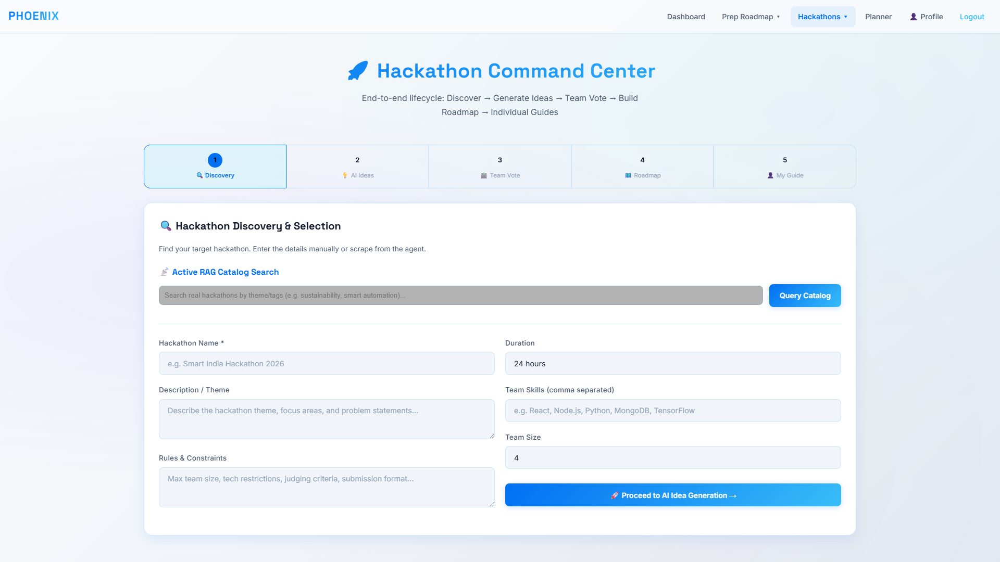

# 🦅 Phoenix — Autonomous Career, Placement & Hackathon OS (v28.0 Enterprise)

[](sup-backend/test/)
[](sup-frontend/enterprise/mesh.html)
[](sup-backend/)
[](screenshots/desktop/)
[]()

> **The Sovereign Tri-Pillar Platform for Student Career Acceleration, Hackathon Dominance, and Placement Mastery**  
> Unifying 3 comprehensive operational pillars: (1) Placement & Interview Preparation OS, (2) Hackathon Builder & Defense Engine, and (3) Phoenix Horizon Regional Career Foundation — governed by an Enterprise Relational Topology Mesh.

---

## 🌐 Platform Hero Showcase



---

## 🌟 The 3 Distinct Core Ecosystem Pillars

Project Phoenix separates the educational and career acceleration lifecycle into **three distinct, non-overlapping pillars** so every student and professional receives a tailored, ultra-smooth experience:

```text
┌────────────────────────────────────────────────────────────────────────────────────────┐
│                              🏰 PHOENIX COMMAND ECOSYSTEM                              │
├──────────────────────────┬─────────────────────────────┬───────────────────────────────┤
│ 🌅 PILLAR 1: HORIZON     │ ⚔️ PILLAR 2: INTERVIEW SPRINT│ 🚀 PILLAR 3: HACKATHON OS     │
│ (Entrance & Career Maps) │ (Placement & Mock Practice) │ (Project Building & Pitching) │
├──────────────────────────┼─────────────────────────────┼───────────────────────────────┤
│ • 📘 PU CS & KCET Prep   │ • 📅 7/14/30-Day Roadmaps   │ • 🌐 Live Hackathon Scraper   │
│ • ⚙️ Diploma DCET Bridge │ • 📚 200+ Company PYQ Bank  │ • ⚡ Two-Stage Vector RAG     │
│ • 🚀 Lateral Entry Guide │ • 🎙️ <300ms Live Voice AI   │ • 🎯 Cross-Encoder Re-Ranker  │
│ • 🛡️ Cybersecurity Track │ • 💻 Isolated VM Sandbox    │ • 🎤 5-Slide Pitch Generator  │
│ • 🌐 Fullstack Web Track │ • 📊 FAANG Percentile Curve │ • ⚖️ AI Judge Defense Rounds  │
│ • 🎯 Syllabus Gap Radar  │ • 💼 Salary Negotiation OS  │ • 💡 AI Idea Generator (RAG)  │
└──────────────────────────┴─────────────────────────────┴───────────────────────────────┘
```

---

## 🏛️ Enterprise Arena Relational Topology & Governance Mesh

Governing 8 specialized engineering arenas and 6 cross-domain corridors via high-throughput mTLS, PQC, and WebSocket corridors:



### Governed Arena Nodes (8 Core Systems)
1. **`NODE-HORIZON`**: Horizon Foundation & Entrance World (KCET / DCET / Mentorship)
2. **`NODE-PLACEMENT`**: Placement Roadmap & Adaptive Practice (Syllabus / PYQs)
3. **`NODE-CHAOS`**: AST Chaos & Sandbox Test Runner (Isolated Node.js VM)
4. **`NODE-HACKATHON`**: Hackathon Command & Scraping Center (MLH / Devpost)
5. **`NODE-JUDGE`**: Adversarial Multi-Round Judge AI (Stress Testing & SAFE Notes)
6. **`NODE-WHITEBOARD`**: Drag-and-Drop System Design Canvas (QPS / SPOF Evaluation)
7. **`NODE-VOICECOACH`**: Live Voice Coach & Audio Telemetry (WPM / Prosody Analysis)
8. **`NODE-ENTERPRISE`**: Recruiter Talent Mesh & EEOC Auditor (Four-Fifths Compliance)

---

## 📸 Desktop 4K Visual Showcase

| Preview | View Name | Module Highlights |
|---|---|---|
|  | **Career Portal Hero** | Dynamic 6-step profile wizard, ATS resume calibrator, and destination world launcher. |
|  | **Arena Topology Mesh** | 5-KPI telemetry strip, 1-click Sever/Restore corridor controls, and real-time latency monitoring. |
|  | **Batch Ingestion Studio** | Dual-pane RFC 4180 CSV & strict JSON streaming engine, monospace audit log, and universal purge safety zone. |
|  | **Horizon Career Pathways** | Regional entrance exams (KCET/DCET), scholarship predictors, and alumni mentorship connections. |
|  | **Placement Studio** | Company question archives, structured interview practice, and personalized skill gap remediation. |
|  | **Hackathon Command Center** | Real-time sprint telemetry, deadline urgency counters, winning idea generators, and judge defense simulator. |

---

## ⚡ Enterprise Governance Capabilities

- **Universal Cascading Deletion**: Dropping any arena node via `DELETE /api/v1/topology/nodes/:id` instantly detects, cascades, and eliminates all interconnected corridors to prevent orphaned routes.
- **Enterprise Batch Ingestion Studio**: Ingests multiline quoted RFC 4180 CSV and strict JSON arrays with automatic property validation.
- **Universal Fleet Cascade Purge**: High-security destructive zone requiring the exact confirmation phrase (`PURGE-ALL-PHOENIX-ENTITIES`) with 1-click factory restore.
- **Sub-20ms Telemetry SLA**: Corridor health telemetry, retry circuits, and mTLS cryptographic verification.

---

## 🧪 Verification & Automated Testing

```bash
# Run the complete test suite
node --test tests/enterpriseMesh.test.js
```

```text
✔ Project Phoenix Enterprise Arena Topology & Governance Mesh (72.2ms)
  ✔ 1. initializes with 8 standard governed arena nodes
  ✔ 2. initializes with 6 high-throughput interoperability corridors
  ✔ 3. computes accurate 5-KPI mesh telemetry
  ✔ 4. successfully provisions a new interoperability corridor
  ✔ 5. prevents duplicate corridor provisioning
  ✔ 6. rejects corridor provisioning with non-existent arena node
  ✔ 7. supports 1-click corridor sever and restore lifecycle
  ✔ 8. drops an individual corridor cleanly
  ✔ 9. executes Universal Cascading Deletion when dropping an arena node
  ✔ 10. ingests RFC 4180 multiline quoted CSV payloads correctly
  ✔ 11. ingests strict JSON batch payloads correctly
  ✔ 12. requires strict safety phrase for Universal Fleet Cascade Purge
  ✔ 13. restores factory default topology mesh after purge

ℹ tests 13, suites 1, pass 13, fail 0
```

---

## 🚀 Quickstart & Setup

```bash
# 1. Clone repository
git clone https://github.com/Shashankcodelover/Phoenix-Interview-Prep_and_Hackathon_Guide.git
cd Phoenix-Interview-Prep_and_Hackathon_Guide

# 2. Install dependencies & build static dist
npm install
npm run build

# 3. Launch application server
npm start
```

Access the live portal at **`http://localhost:5000/`** and the Enterprise Topology Mesh at **`http://localhost:5000/enterprise/mesh.html`**.


## User Flow Verification


