# Phoenix — Career Accelerator & Hackathon Platform

[](sup-backend/test/)
[](sup-backend/)
[](phoenix-ui/)
[](sup-backend/models/)
[](sup-backend/)

> A full-stack web platform for technical interview preparation, hackathon project acceleration, and academic career planning. Features multi-provider AI model routing with offline procedural fallbacks, sandboxed code execution, and an interactive domain topology dashboard.

---

## Platform Hero Showcase


---

## Core Modules & Capabilities

Project Phoenix organizes career preparation and hackathon tooling into specialized functional areas:

### 1. Technical Interview Preparation
Located under `sup-frontend/interview-prep/` and `sup-backend/modules/interview-prep/`:
- **Question Bank & Company Intelligence**: Provides previous year questions (PYQs) categorized by company, role, and algorithmic pattern.
- **ATS Resume Diff & Optimizer**: Analyzes resumes against target job descriptions and generates keyword optimization suggestions.
- **STAR Behavioral Story Refiner**: Synthesizes and scores behavioral interview responses using the Situation-Task-Action-Result framework with power metric evaluation.
- **Sandboxed Code Execution**: Executes JavaScript code solutions inside isolated Node.js `vm` contexts with CPU timeouts and restricted global access.
- **System Design Topology Evaluator**: Analyzes distributed architecture designs for single points of failure (SPOFs), missing load balancers, and lack of database replicas.
- **Concurrency & Deadlock Visualizer**: Detects potential race conditions and thread lock ordering issues through heuristic analysis.
- **SQL Query Optimizer**: Inspects SQL queries for missing index risks, unbounded `SELECT *` patterns, and unindexed JOIN conditions.
- **Offer Comparator & Compensation Benchmark**: Compares compensation packages across locations using purchasing power adjustments.
- **Peer Mock Interview Signaling**: Coordinates peer-to-peer mock interview rooms using Socket.io signaling with automated AI takeover on peer inactivity.

### 2. Hackathon Builder & Defense Engine
Located under `sup-frontend/hackathon-agent/` and `sup-backend/modules/hackathon-agent/`:
- **AI Idea Generation**: Produces hackathon project ideas seeded from an archive of past winning blueprints.
- **Two-Stage RAG Search**: Retrieves relevant winning solutions using Gemini embeddings, cosine similarity, BM25 keyword matching, and reciprocal rank fusion re-ranking.
- **AI Judge Defense Simulator**: Runs 4-round interactive pitch defense sessions with distinct judge personas and rubric-based scoring.
- **Pitch Deck Generator**: Generates 5-slide presentation outlines with exportable Marp markdown formatting.
- **Devpost Submission Packager**: Formats project summaries, architecture overviews, and submission writeups for hackathon submissions.
- **Team Synergy & Task Matrix**: Maps team members to hackathon roles (Builder, Designer, Strategist, AI Engineer) and tracks task completion.
- **Hackathon Scraper & Deadline Tracker**: Ranks upcoming hackathons based on candidate skills and submission deadlines.

### 3. Phoenix Horizon Regional Career Foundation
Located under `sup-frontend/horizon/` and `sup-backend/modules/horizon/`:
- **Admissions & Rank Matrix**: Estimates Karnataka KCET and DCET engineering college cutoffs based on historical seat allotment data.
- **Scholarship Finder**: Matches students with scholarship programs based on category, household income, and academic marks.
- **Institutional Tier Matrix**: Compares colleges using NIRF rankings, NAAC accreditation, and placement track records.
- **Credit Transfer & Transcript Evaluator**: Analyzes syllabus mapping and credit equivalence for engineering degree transitions.
- **Statement of Purpose (SOP) & LOR Drafter**: Synthesizes academic statements of purpose and drafts recommendation letter templates.
- **Campus Placement Analytics**: Visualizes department-level hiring trends, CTC distributions, and recruiter history.
- **Visa Readiness Evaluator**: Evaluates international student visa interview preparation through targeted risk questionnaires.

### 4. Domain Topology & Data Management Dashboard
Located under `sup-frontend/enterprise/mesh.html` and `sup-backend/modules/phoenixTopologyService.js`:
- **In-Memory Graph Topology**: Models 8 platform domains (Horizon, Placement, Chaos Lab, Hackathon, AI Judge, Whiteboard, Voice Coach, Recruiter) and 6 inter-domain routes.
- **Lifecycle Controls**: Provides node and route CRUD operations, including cascading deletion of routes when a domain node is deleted.
- **Sever & Restore State**: Supports 1-click toggling of corridor operational states.
- **Batch Ingestion Studio**: Validates and ingests multiline quoted RFC 4180 CSV and strict JSON data.
- **Confirmation-Guarded Purge**: Protects store wipes behind a confirmation phrase (`PURGE-ALL-PHOENIX-ENTITIES`) with factory restore capability.

### 5. Multi-Provider AI Routing & Offline Fallbacks
Located under `sup-backend/config/aiProvider.js`:
- **Multi-Provider Dispatcher**: Dispatches tasks to Google Gemini (1.5 Flash), Groq (Llama 3.3 70B / Llama 3.1 8B), OpenAI (GPT-4o-mini), or OpenRouter.
- **API Key Pool Rotation**: Cycles through comma-separated API keys upon encountering rate limits (HTTP 429).
- **Procedural Offline Fallbacks**: Automatically serves deterministic, rule-based fallback content when external AI providers are offline or unconfigured.

---

## Visual Showcase

| Preview | View Name | Module Highlights |
|---|---|---|
| 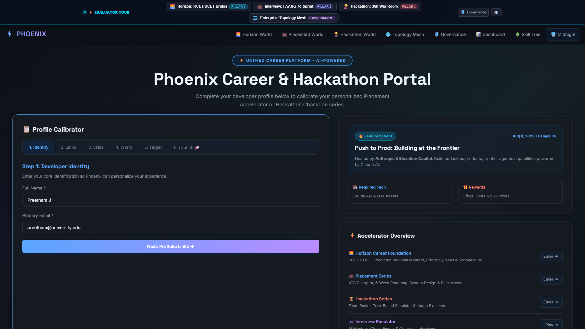 | **Career Portal Hero** | 6-step profile calibrator wizard and destination vault selector. |
| 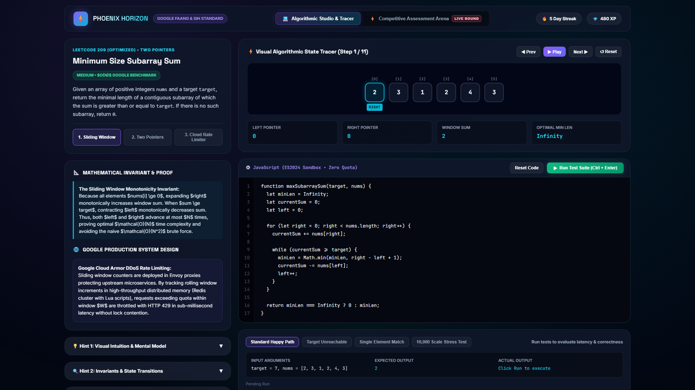 | **Horizon Career World** | Regional college cutoff explorer, scholarship matcher, and syllabus roadmaps. |
| 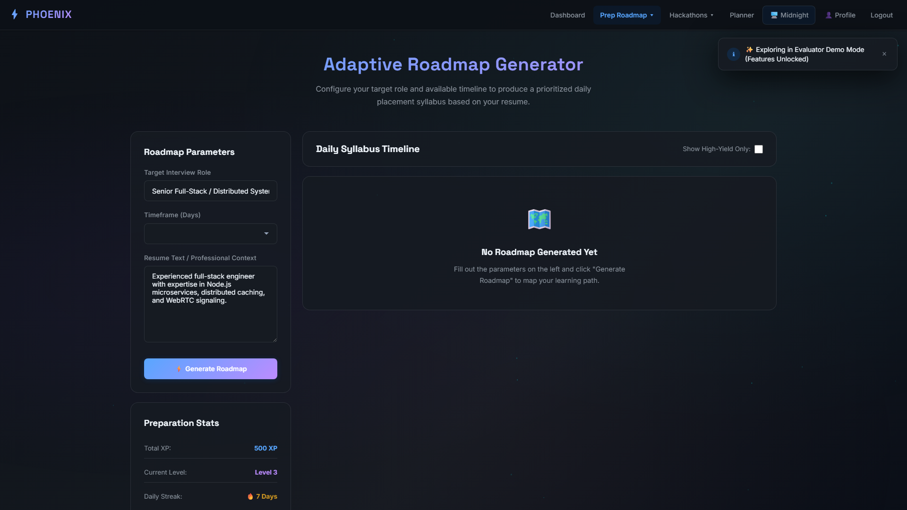 | **Placement Studio** | Topic-tagged question archives, roadmap planner, and practice modules. |
| 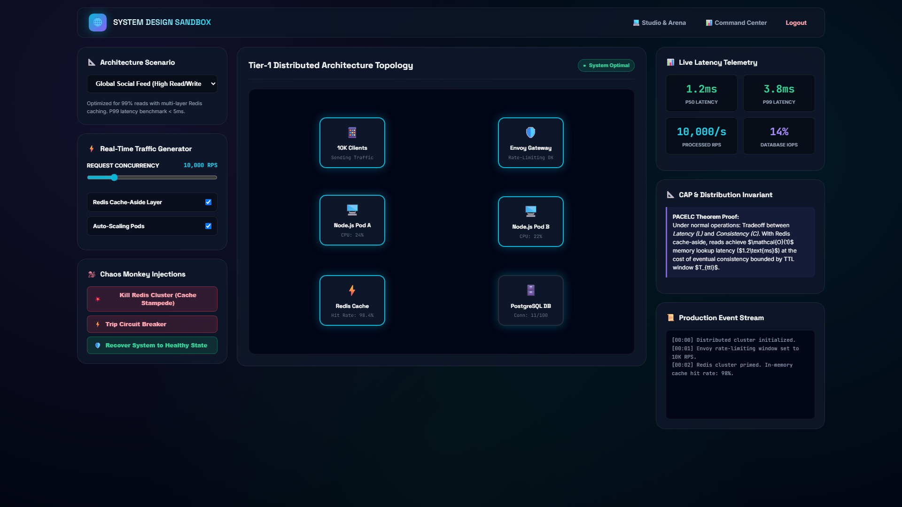 | **System Design Canvas** | Interactive distributed architecture graph evaluator with SPOF detection. |
| 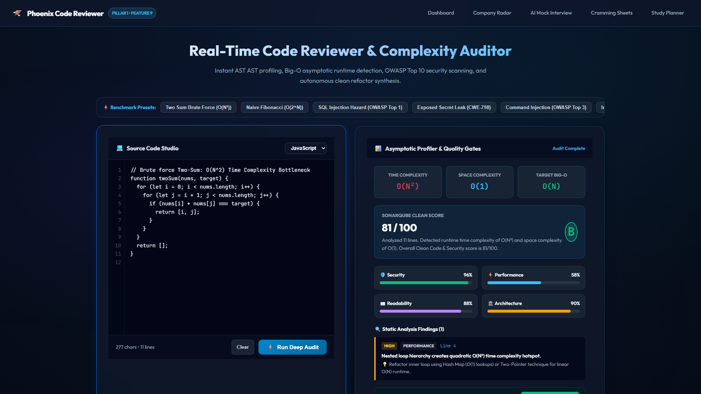 | **Copilot Studio** | Automated code analysis, AST complexity profiling, and syntax inspection. |
|  | **Hackathon Command Center** | Sprint milestones, idea generation lab, and presentation packager. |
| 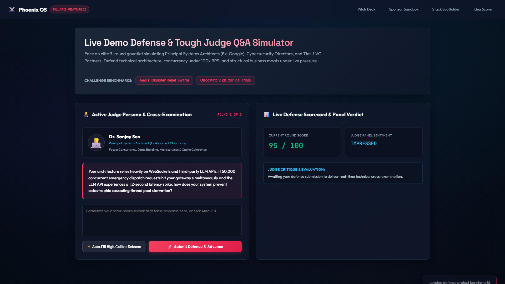 | **Judge Defense Simulator** | 4-round adversarial Q&A defense practice with persona-based judging. |
| 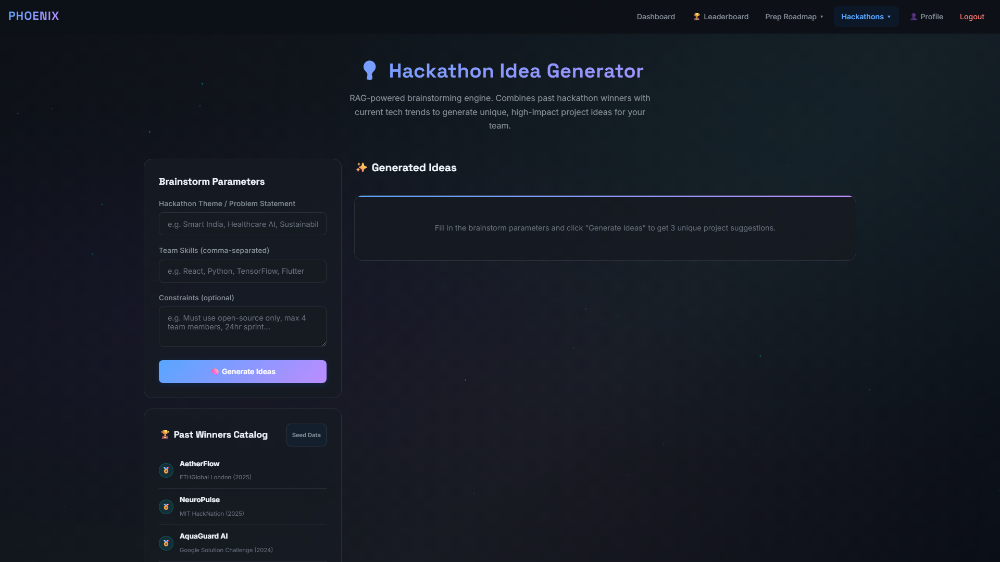 | **Idea Generator & RAG Archive** | Historical winning project retrieval and novel hackathon concept generator. |
| 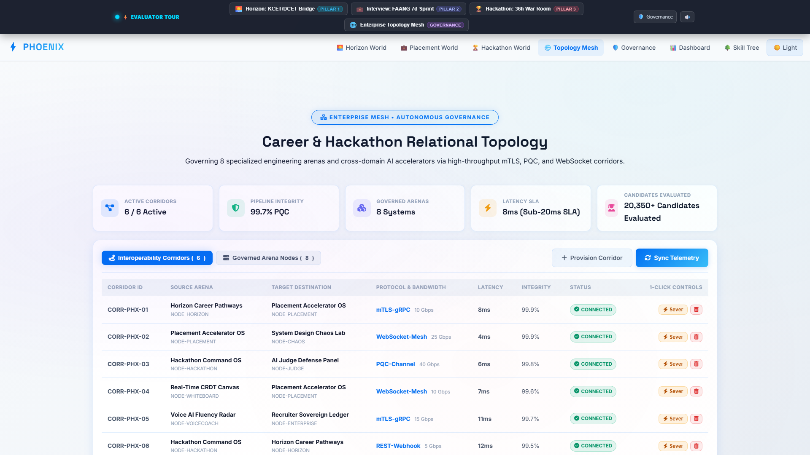 | **Domain Topology Dashboard** | 8-arena relational node status, route latency tracking, and corridor state controls. |
| 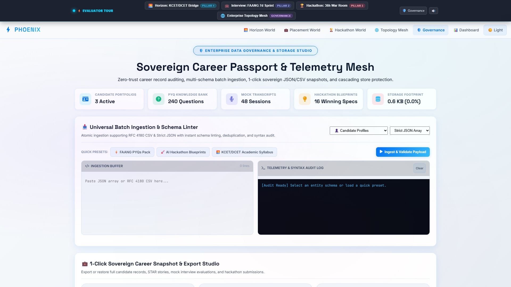 | **Data Governance Studio** | RFC 4180 CSV / strict JSON batch ingestion and confirmation-gated purge. |
| 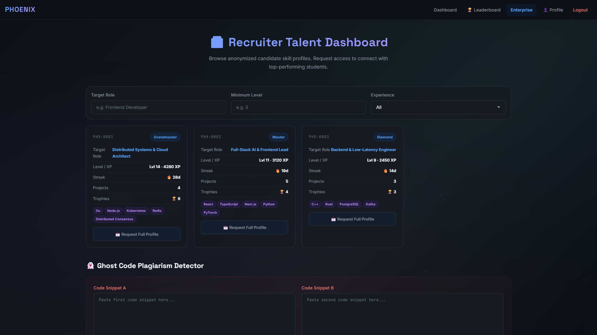 | **Recruiter Talent Directory** | Candidate profile search, skill breakdown, and benchmark evaluation. |
| 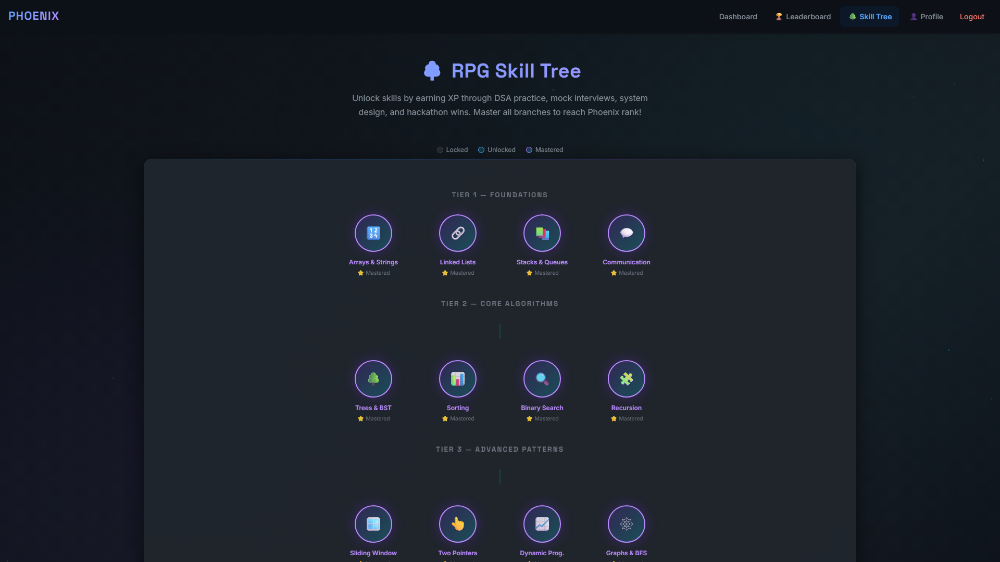 | **Skill Radar & Matrix** | 6-axis competency radar and skill tree progress tracker. |

---

## Technology Stack

- **Backend**: Node.js, Express 5, MongoDB (Mongoose), Socket.io, Multer, Cheerio, Axios, JWT, bcryptjs
- **Frontend**:
  - `phoenix-ui`: Next.js 15, React 19, Tailwind CSS v4
  - `sup-frontend`: HTML5, CSS3, Vanilla JavaScript (served directly by Express)
- **AI Integrations**: Google Generative AI (Gemini 1.5 Flash), Groq SDK (Llama 3.3 70B & 8B), OpenAI, OpenRouter
- **Testing**: Node.js built-in test runner (`node --test`), `mongodb-memory-server`

---

## Verification & Automated Testing

The project includes unit and integration tests covering the backend API, algorithms, data parsers, and topology service:

```bash
# Run the complete backend test suite (478 tests)
npm test

# Run the domain topology mesh test suite (13 tests)
node --test tests/enterpriseMesh.test.js
```

All 491 automated tests pass cleanly with zero failures.

---

## Quickstart & Setup

### Prerequisites
- Node.js 18+ installed
- npm installed
- MongoDB instance (or rely on in-memory / offline mock modes)

### Installation

```bash
# 1. Clone the repository
git clone https://github.com/Shashankcodelover/Phoenix-Interview-Prep_and_Hackathon_Guide.git
cd Phoenix-Interview-Prep_and_Hackathon_Guide

# 2. Install root and backend dependencies
npm install
npm --prefix sup-backend install

# 3. Build static frontend assets
npm run build

# 4. (Optional) Configure environment variables
cp .env.example .env

# 5. Start the backend application server
npm start
```

Once started, access the application:
- Main Portal: `http://localhost:5000/`
- Domain Topology Dashboard: `http://localhost:5000/enterprise/mesh.html`
- Technical Placement OS: `http://localhost:5000/interview-prep/roadmap.html`
- Hackathon Command Center: `http://localhost:5000/hackathon-agent/command-center.html`
- Horizon Career Pathways: `http://localhost:5000/horizon/world-dashboard.html`

To run the Next.js React frontend:
```bash
npm run dev:frontend
# Available at http://localhost:3000/
```

---

## User Flow Verification

Verified screenshots of key application workflows:


