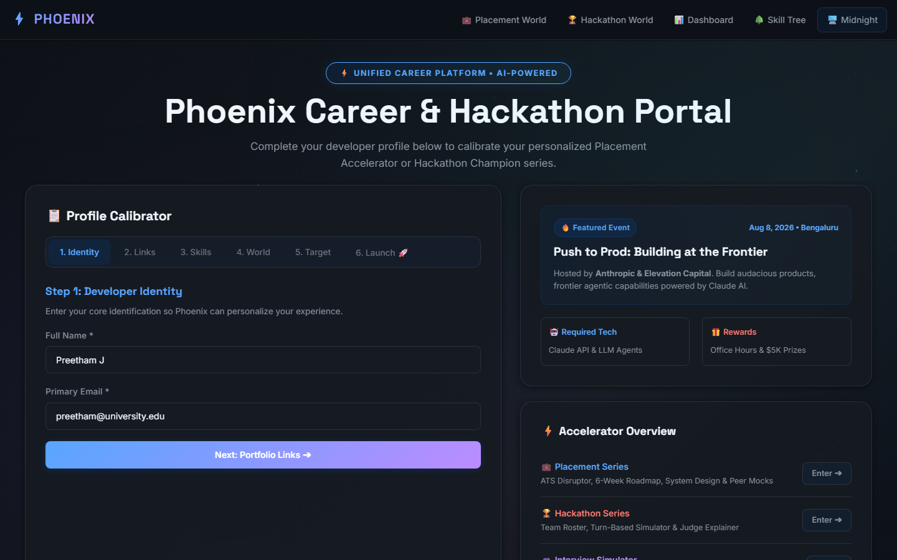
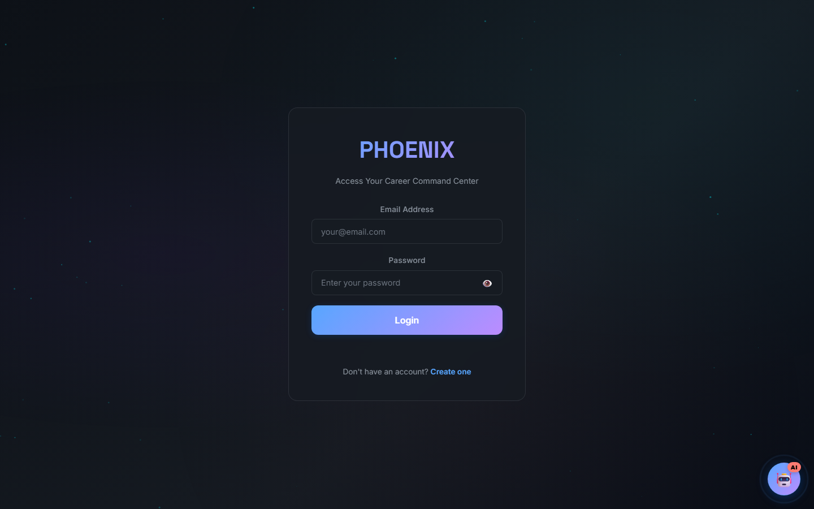
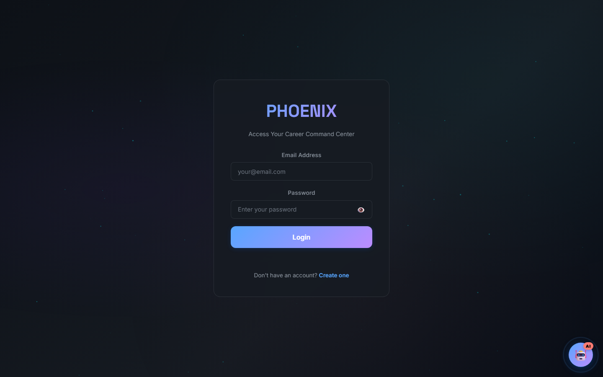
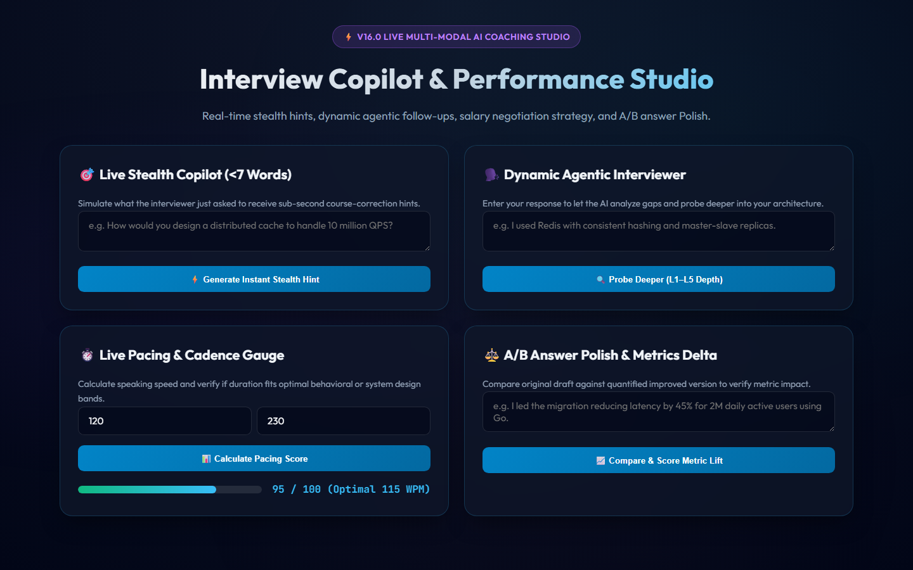
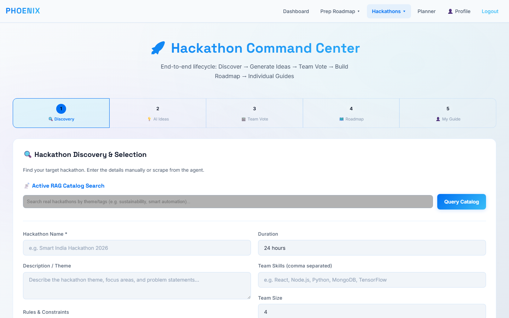
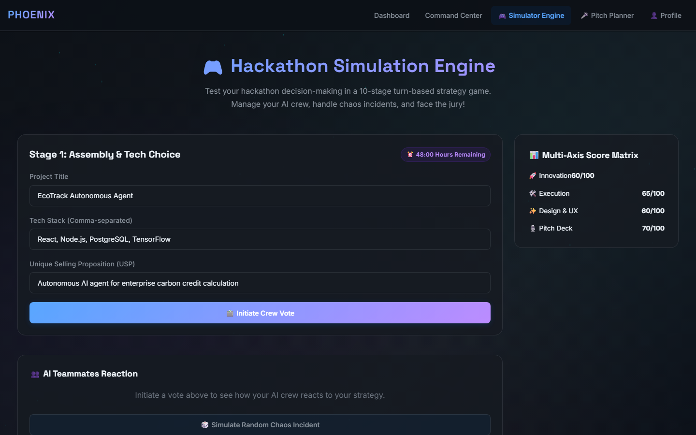
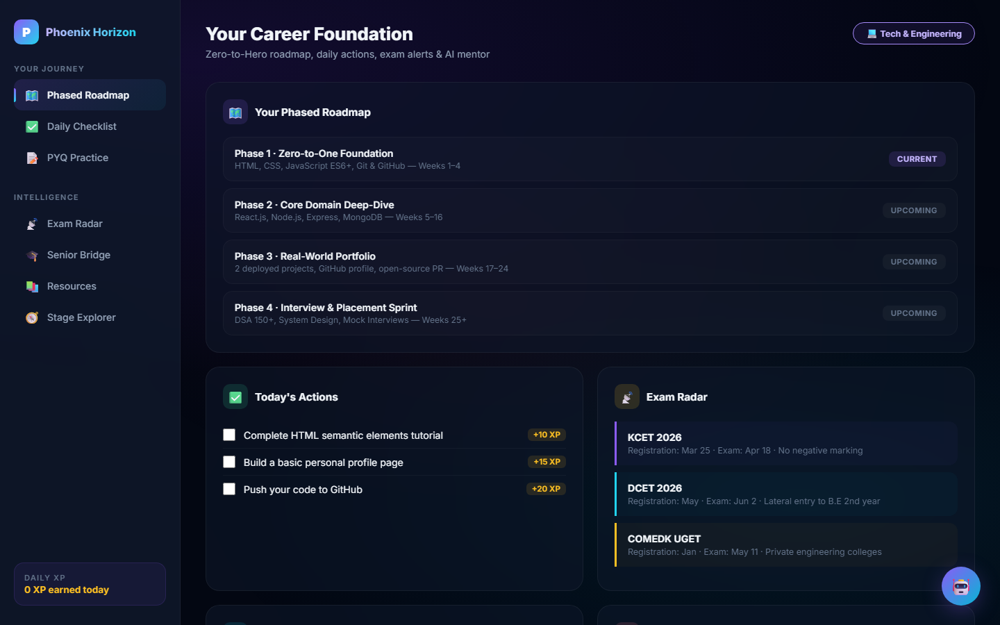

# 🦅 Phoenix — Autonomous Career, Placement & Hackathon OS (v26.0 Enterprise)

> **The Sovereign Tri-Pillar Platform for Student Career Acceleration, Hackathon Dominance, and Placement Mastery**  
> Unifying 3 comprehensive operational pillars: (1) Placement & Interview Preparation OS, (2) Hackathon Builder & Defense Engine, and (3) Phoenix Horizon Regional Career Foundation.

---

## 📸 Canonical Showcase Gallery

### 1. Unified Gateway & Core Analytics
| Pillar / View | Screenshot | Description |
|---|---|---|
| **Pillar Gateway** |  | Unified career launchpad connecting interview prep, hackathon defense, and regional education. |
| **Skill Radar & Mastery Matrix** |  | 6-axis competency radar (DSA, System Design, Security, Voice, Pitch, Core CS) with real-time XP and weakness remediation. |

### 2. Pillar 1: Placement & Interview Preparation OS
| Module | Screenshot | Description |
|---|---|---|
| **Mock Interview Studio** |  | Multimodal interview chamber with timer, real-time question prompter, and STAR delivery scorer. |
| **System Design Architecture Canvas** |  | Drag-and-drop cloud architecture whiteboard evaluating QPS, SLA, and Single Point of Failure (SPOF) risks. |
| **AI Copilot & Live Voice Coach** |  | Real-time speech analysis engine measuring Words-Per-Minute (WPM), filler word density, and vocal prosody. |

### 3. Pillar 2: Hackathon Builder Defense Engine
| Module | Screenshot | Description |
|---|---|---|
| **Hackathon OS Command Center** |  | Centralized sprint telemetry tracking deadline urgency, repository health, and team synergy. |
| **Live AI Judge Defense Simulator** |  | Multi-round adversarial grilling chamber with tough technical judge personas (Tech Lead, Domain VC, Ethics Auditor). |
| **Winning Idea Generator** |  | RAG-powered project idea synthesis leveraging past Devpost/MLH winning project patterns and SAFE equity modeling. |

### 4. Pillar 3: Phoenix Horizon & Enterprise Governance
| Module | Screenshot | Description |
|---|---|---|
| **Horizon Career World** |  | Regional education and entrance roadmap (KCET, DCET, NEET, CA Foundation) with senior mentor advice bridges. |
| **Enterprise Recruiter Telemetry** |  | Corporate hiring manager dashboard with EEOC four-fifths fairness compliance audits and cryptographic data portability. |

---

## 🏛️ Tri-Pillar Architecture Breakdown

### Pillar 1: Placement & Interview Preparation OS
- **AST Runtime & Complexity Inspector**: Babel AST parser detecting nested loops, time complexity `O(N^2)`, and auxiliary space.
- **Adaptive IRT Recommendation**: Item Response Theory maximizing Fisher Information to present questions matching true candidate theta ability.
- **Peer Mock Mesh**: WebRTC peer signaling mesh with AI Safety-Net heartbeat takeover when a human peer disconnects.
- **Company Intelligence**: Curated interview patterns, target profiles, and behavioral norms for top tech employers.

### Pillar 2: Hackathon Builder Defense Engine
- **RAG Winner Knowledge Base**: Hybrid vector embeddings + BM25 keyword retrieval matching winning project architectures.
- **Adversarial Judge Grilling**: 5-round progressive stress testing designed to expose architectural weaknesses before judging.
- **Marp Pitch Deck Synthesizer**: Generates 5-slide investor/judge presentation blueprints formatted in presentation markdown.
- **SAFE Note & IP Governance**: Apache-2.0 patent license, founder vesting schedules, and post-hackathon seed SAFE agreements.

### Pillar 3: Phoenix Horizon Regional Career Foundation
- **360° Diagnostic Engine**: Maps student stage (10th, 12th/PU, Diploma, College) to customized domain worlds.
- **KEA Exam Radar**: Real-time notifications and countdown clocks for KCET, DCET, NEET, and COMEDK entrance exams.
- **Senior Mentorship Bridge**: Verified alumni advice cards and mistakes-to-avoid pathways from senior engineering leads.

---

## 🧪 Verification & Automated Testing
- **Test Framework**: Node.js Built-in Test Runner (`node:test`, `node:assert/strict`)
- **Total Test Suites**: `136 passed, 136 total`
- **Total Tests**: `336 passed, 0 failed, 14 skipped, 350 total`
- **Execution Time**: ~3.2 seconds
- **Production Server**: Express 5.2 + Socket.io running on Node v25
